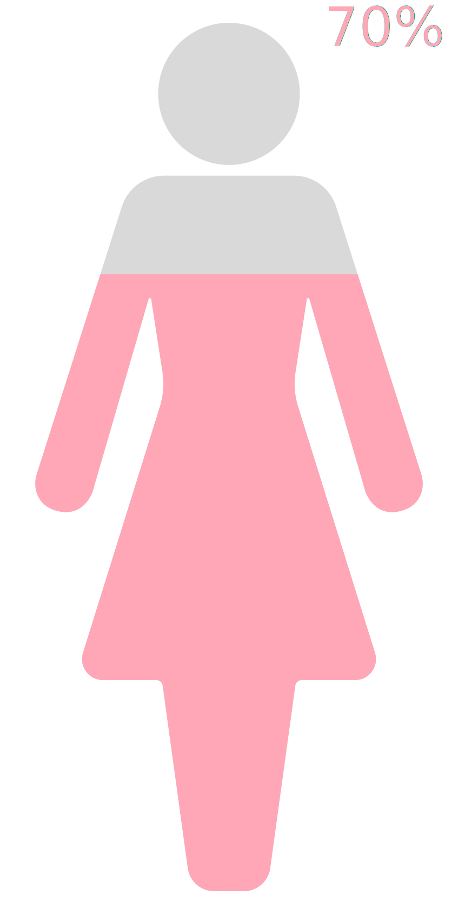

# polyfillR
Partially fill SVG polygons with a color in R

#Usage

```r
library(polyfillR)

femalePlot <- female_polygon(70, size="64px")
malePlot   <- male_polygon(30, size="64px")

# place the two images together in a div and print it to the output (e.g., knitr document)
cat(paste0("<div style='display:flex;'>", femalePlot, malePlot, "</div>"))
```

<div style="display:flex;">


</div>
